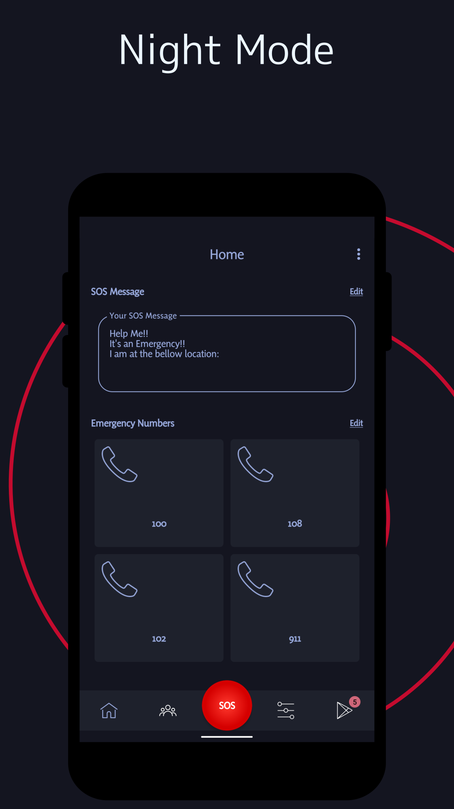
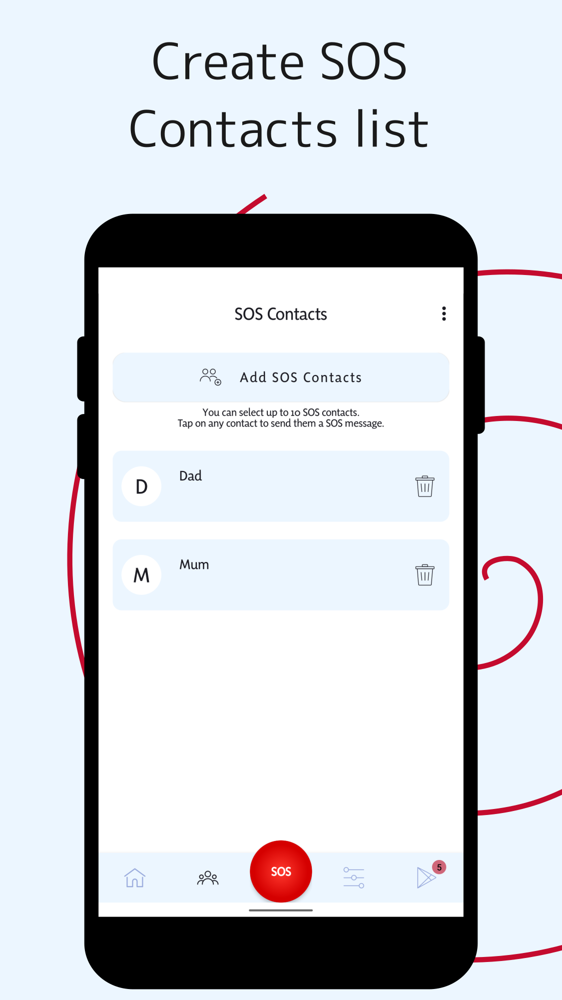
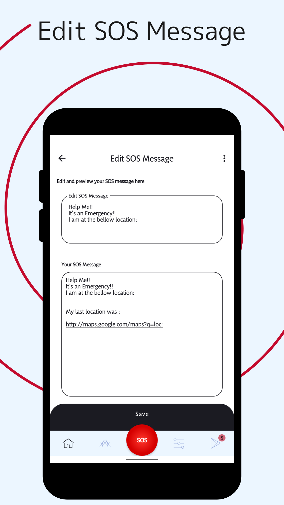

# SOSApp

-------------------------------------------------
SOSApp – Features
-------------------------------------------------

- Send SOS message with location and address
- Get and call emergency numbers by country
- Add up to 10 SOS emergency contacts
- Tools like SOS siren and SOS flash light
- SOSApp widget to use all features without launching the app

SOSApp is available on the Google Play Store.  

We hope this app serves you well.

SOSApp is developed by Arupakaman Studios.
Arupakaman Studios is a group of independent developers working on various applications and services.

You can send us your feedback and app suggestions via email.

## Contact Us

Contact us at: arupakamanstudios[AT]gmail[DOT]com

## Licensing

SOSApp is licensed under the [MIT License.](LICENSE)